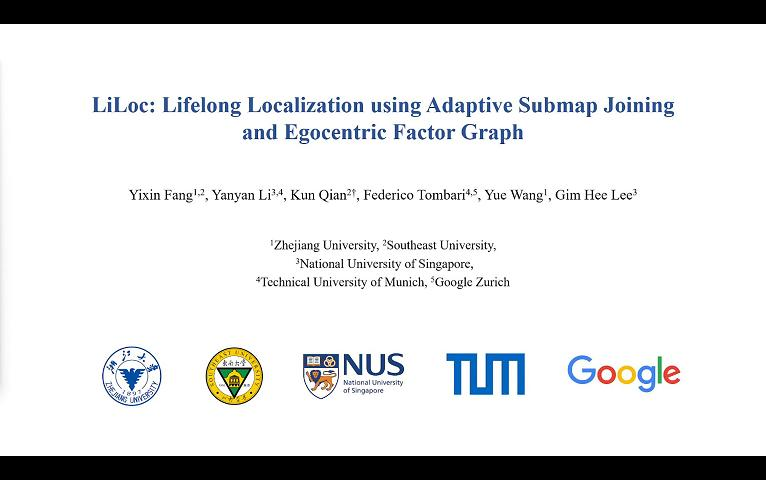

<div align="center">
    <h1>LiLoc</h1>
    <br />
    <a href=https://youtu.be/Kc2azOG8TSU>🎬Youtube</a>
    <span>&nbsp;&nbsp;•&nbsp;&nbsp;</span>
    <a href=https://www.bilibili.com/video/BV1uatkeFEWL/?vd_source=7936e3be9727382a31661ae25224c8ad>🎬Bilibili</a>
    <span>&nbsp;&nbsp;•&nbsp;&nbsp;</span>
    <a href="https://github.com/Yixin-F/LiLoc/blob/main/README.md#Installation">🛠️Installation</a>
    <span>&nbsp;&nbsp;•&nbsp;&nbsp;</span>
    <a href=https://arxiv.org/abs/2409.10172>📑Paper</a>
  <br />
  <br />
</div>




This repository contains the source code for our ICRA2025 paper. In this work, we propose a versatile graph-based lifelong localization framework, <strong>LiLoc</strong> , which enhances its timeliness by maintaining a single central session while improves the accuracy through multi-modal factors between the central and subsidiary sessions. The main contributions are as follows:

- A graph-based framework for long-term localization featuring a flexible mode-switching mechanism, to achieve accurate multi-session localization.
- An adaptive submap joining strategy to dynamically manage (i.e., generate, select and update) prior submaps, reducing system memory consumption while ensuring the timeliness of prior knowledge.
- An egocentric factor graph (EFG) module to tightly couple multi-modal constrains, along with a novel propagation model to enhance  prior constrains by distributing weighted scan matching factors in joint factor-graph optimization (JFGO). 
- We achieve the competitive performance on public and custom datasets and the proposed system will be released for community use.


***
## Installation
### 1. Prerequisites
#### 1.1 System and third-party packages
- Ubuntu $\geq$ 18.04 (tested on Noetic)

- PCL $\geq$ 1.8 (tested on PCL 1.10)

- Eigen >= 3.3.4 (default for Ubuntu 20.04)

- OpenCV $\geq$ 4.0 (tested on OpenCV 4.2)

- GTSAM $\geq$ 4.0.3 (tested on GTSAM 4.2(a))

#### 1.2 Other Packages
- [ndt_omp](https://github.com/koide3/ndt_omp)
- [livox_ros_driver](https://github.com/Livox-SDK/livox_ros_driver)
- [better_fastlio2](https://github.com/Yixin-F/better_fastlio2) (Refer to the module of "pose initialization" in this open-source repository, the new reconstructed code is comming soon.)

### 2. Build
```bash
cd <your workspace>/src
git clone https://github.com/koide3/ndt_omp
git clone https://github.com/Livox-SDK/livox_ros_driver
git clone https://github.com/Yixin-F/LiLoc

cd ..
catkin_make
source devel/setup.bash
```

## Run
####  <strong>Remark 1:</strong> How to set your localization mode ?
Since LiLoc is a graph-based localization method with a mode-switching mechanism, you need to provide the directory where your prior maps are stored and confirm your localization mode.  Edit the parameter `mode` in `config/*.yaml` files to change the localization mode. If your set `lio`, LiLoc can be truned in to incremantal localization mode and be directly used as a SLAM algorithm. You should edit the parameter `savePCDDirectory` in `config/*.yaml` files to confirm where the results are stored. Otherwise, if you set `relo`, LiLoc is truned in to relocalization mode. So, you should edit the parameter `savePCDDirectory` in `config/*.yaml` files to confirm where the prior knowledge are loaded and the parameter `saveSessionDirectory` in `config/*.yaml` files to confirm where the upated central session maps are stored.

####  <strong>Remark 2:</strong> How to set the initial pose ?
Since our code of "pose initailization" is under reconstrucion, you can directly use the "2D pose estimation" or refer to our previous repository named [better_fastlio2](https://github.com/Yixin-F/better_fastlio2) to set the initial pose. The reconstructed code will be publicly aviliable as soon as possible.

####  <strong>Remark 3:</strong> How to save your results ?
```bash
rosservice call /liloc/save_map 0.2 1 1  # save results of the current session
```
```bash
rosservice call /liloc/save_session 0.2  # save results of the updated central session
```


### 1. NCLT dataset
Download NCLT from [https://robots.engin.umich.edu/nclt/](https://robots.engin.umich.edu/nclt/)
```bash
roslaunch block_localization run_nclt.launch
```

### 2. M2DGR dataset
Download M2DGR from [https://github.com/SJTU-ViSYS/M2DGR](https://github.com/SJTU-ViSYS/M2DGR)
```bash
roslaunch block_localization run_m2dgr.launch
```

### 3. Our School dataset
Download the School dataset from [Google Driver](https://drive.google.com/drive/folders/14u6axUkISU5j9CxxUYEoU7Le1qneiOvA?usp=sharing)
```bash
roslaunch block_localization run_lio_sam_mid360.launch
```

### 4. Our Factory dataset
Download the Factory dataset from [Google Driver](https://drive.google.com/drive/folders/13e476AmgzPgjNNQ71qwy_0sErJg4607J?usp=sharing)
```bash
roslaunch block_localization run_lio_sam_default.launch
```


## Citation
If you use any of this code, please cite our [paper](https://arxiv.org/abs/2409.10172).

```bibtex
@article{fang2024liloc,
  title={LiLoc: Lifelong Localization using Adaptive Submap Joining and Egocentric Factor Graph},
  author={Fang, Yixin and Li, Yanyan and Qian, Kun and Tombari, Federico and Wang, Yue and Lee, Gim Hee},
  journal={arXiv preprint arXiv:2409.10172},
  year={2024}
}
```

## Acknowledgements
Thanks for the open-source projects [LIO-SAM](https://github.com/TixiaoShan/LIO-SAM), [liorf](https://github.com/YJZLuckyBoy/liorf) and [Block-Map-Based-Localization](https://github.com/YixFeng/Block-Map-Based-Localization).


